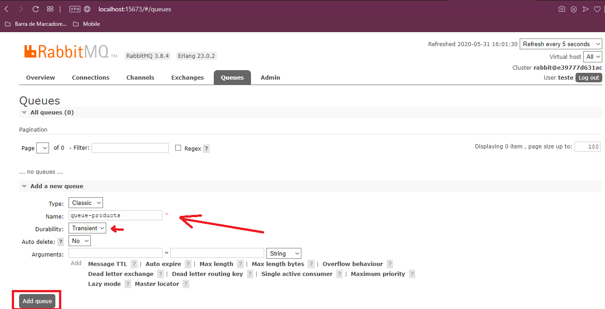
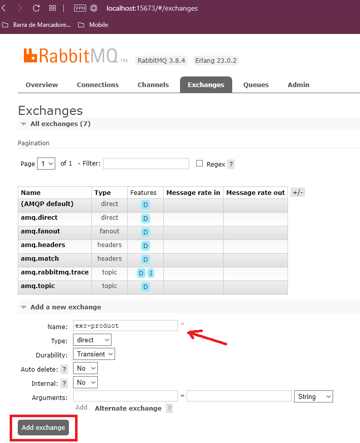
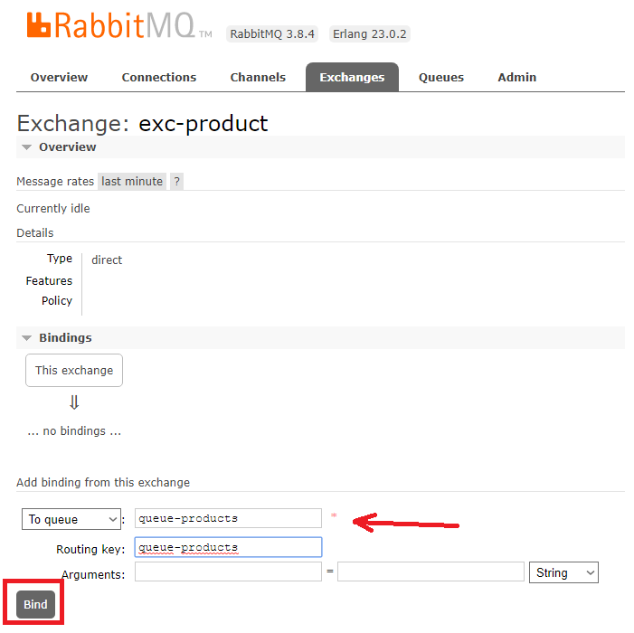

# Console Application para Consumir e Produzir em uma fila do RabbitMQ

- O projeto Send produz uma mensagem que você pode digitar via console application e envia para uma determinada fila do RabbitMQ.

- O projeto Receive consome a(s) mensagem(ns) desta fila do RabbitMQ.

Projeto básico de exemplo apenas demonstrando consumo e produção para uma fila.

O rabbitmq foi criado no docker através do comando abaixo:

```diff
docker run -d --name docker-rabbitmq -p 5673:5672 -p 15673:15672 -e RABBITMQ_DEFAULT_USER=teste -e RABBITMQ_DEFAULT_PASS=Teste2020! rabbitmq:3-management
```

Foram criados usuário e senha diferentes do padrão do RabbitMQ (guest/guest). Caso não queira utilizá-los ou alterar para outro usuário e senha, também será necessário modifcar nas aplicações console.

Após criado o container no docker, será possível acessar externamento no navegador pela url: <b>http://localhost:15673/</b>


<hr>
<h4>Primeiro criamos uma fila para armazenar nossas mensagens. Caso não seja criada a fila, ao executar a chamada no código da aplicação, o RabbitMQ se encarrega de criá-la.</h4>


<hr>
<h4>Depois criamos uma exchange. Por default o RabbitMQ utiliza uma exchange padrão, por isso quando você testa enviando/consumindo de uma fila sem mencionar a exchange, funciona normalmente.</h4>


<hr>
<h4>Já que criamos nossa exchange, é necessário informar a qual fila ela vai fazer a rota e através de qual chave, conforme imagem abaixo:</h4>


<hr>
Agora é só deixar a aplicação Receive aberta. Executar a aplicação Send e começar a enviar as mensagens para a fila.
Nossa aplicação Receive vai começar a processar as requisições e exibi-las no console.
